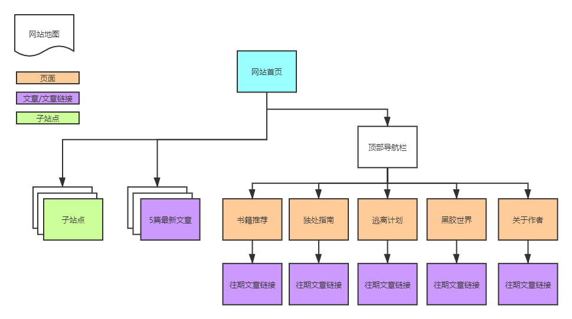
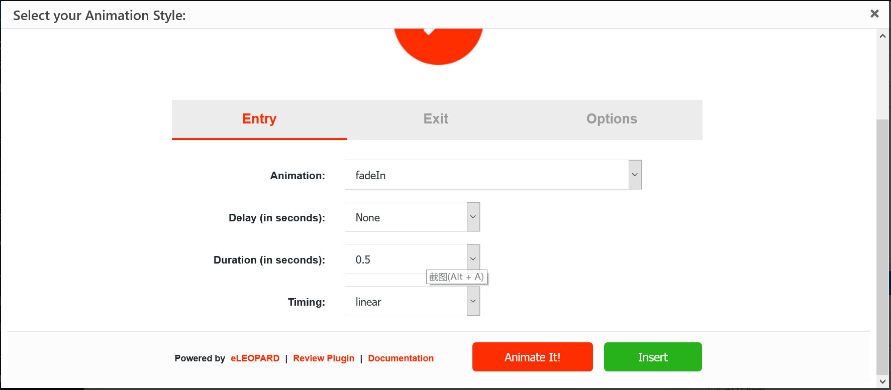
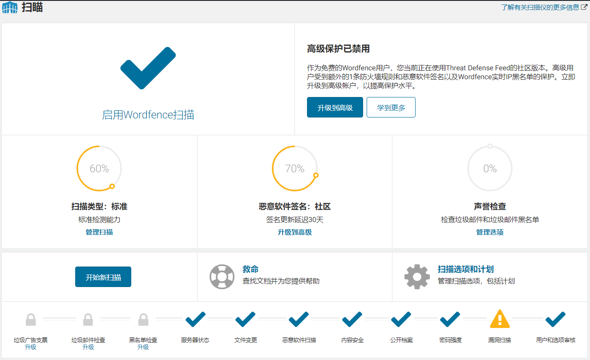
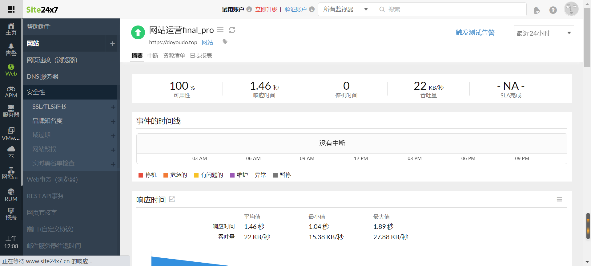
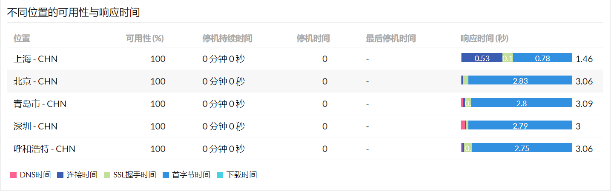
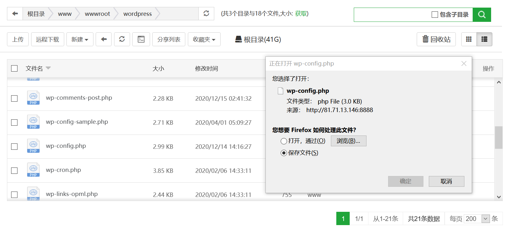
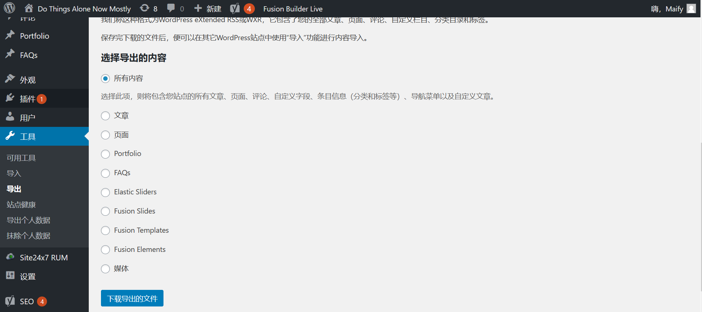
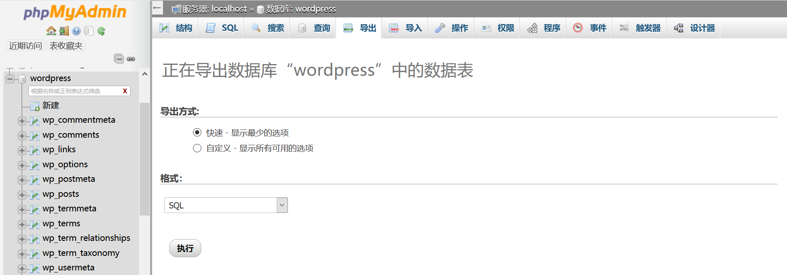
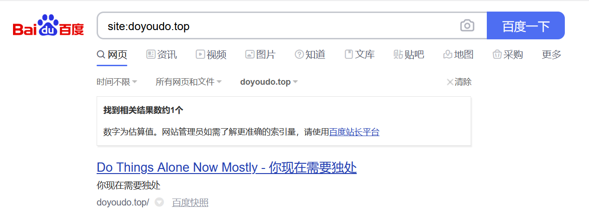
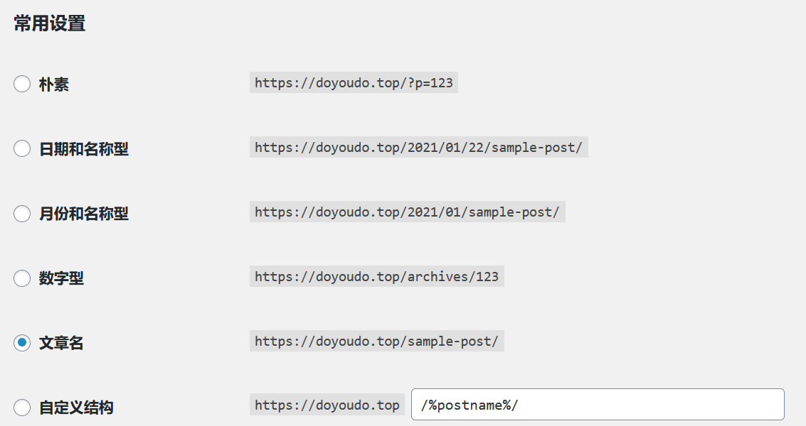

# 网站运营期末项目报告

## 网站简介
- 网站名称：Do Things Alone Now Mostly
- URL：https://doyoudo.top
- 站长：麦锋源
- 指导老师：胡美香
- 网站搭建运用wordpress模板支持
- 项目展示：

***

# 一、策划
 

## 1.策划文档与网站地图

> "策划文档"将明确对网站建设目标、目标用户、网站发展规划和网站版面设计等进行详细的介绍和说明。

 

### 网站建设目标
- 网站围绕现代城市生活中热爱独处的人为主，以博客内容的形式输出个体文化
- 通过书籍、影音、日志的形式为城市生活的人匹配属于自己的精神世界，在文字间得到心灵的共鸣
- 网站希望建立一个爱好独处或希望拥有独处的空间，远离繁杂与喧嚣

### 网站规划

|生命周期|规划|
| --- | --- |
|基础建设|网站整体架构规划、数据库后台管理、后台管理系统建设、前台界面设计、服务器运转、域名绑定|
|中期运营|网站下分四个板块进行内容更新：书籍推荐、独处指南、逃离计划、黑胶世界|
|后期拓展|四个板块将根据相关内容引入电商模式进行线上销售，包括书籍购买、旅行购票和音乐使用版权等|
|网站优化|持续更新网站内容，提供更优质的的文章，同时做好网站SEO工作提高网站流量，保持较好的网站运营能力。|

#### 项目策划表
|  | 步骤 | 措施 |
| --- | --- | --- |
| 1 | 目的及功能定位 | 通过用户访谈以及用户体验地图分析定位以及确定目标用户 |
| 2 | 技术解决方案 | (a)服务器：腾讯云定制版服务器 (b)技术栈：Centos+宝塔系统（Lnmp）+WordPress (c)网站安全性措施：利用Wordfence、site24x7监控安全性能 (d)WordPress主题：Astra (e)插件: Elementor、Elementor Pro、Jetpack、Tutor LMS、Wenprise Pinyin Slug、Wordfence Security、WPForms Lite、Yoast SEO |
| 4 | 内容规划 | 博客文章分享及相关产品销售 |
| 5 | 网页设计 | 网站贯彻"Less is more"的极简主义风格，并且按用户需求进行不定期改版 |
| 6 | 网站维护 | (a)内容：分享贴子一星期更新一次 (b)数据库维护：一星期备份一次以及进行分析 (c)服务器：24小时内停机不可超过5小时 |
| 7 | 网站测试 | 服务器以及数据库两天测试一次 |

 

### 目标用户画像

 

### DVF模型
基于用户调研和访谈，使用DVF模型定义需求，打造多元化的网站，更大限度地满足用户的需求。

 

#### 网站地图

 

## 2.网站平面设计

> 平面设计：网站配色、对比度与可读性：要求配色合谐卓越丶可读性卓越。
> 图片的使用：要求非原创的每张图片都要有版权交待，且有超链接（链接至原网站）；
> 图库风格及配色: 要求说明风格、配色、图片风格的选择为何与内容和主题相符。

 

#### (1)图片版权
- 网站图片来源：百度百科、豆瓣、创客贴
- 每篇文章结尾或每张图片底下均表明图片来源，且有超链接至图片出处，点击即可跳转查看原图片的出处

 

#### (2)图片风格及配色
1. 风格：网站主要以冷色调为主，搭配简约风格的网站排版，带来出干净，整洁的观感体验
2. 配色：以奶灰色为主，黑白为辅
- 特色图片悬停类型：放大（zoom in）
- 控制整个Fusion Builder元素的主要高亮颜色：#65bc7b
- 品牌颜色(Branding)：#3F51B5

#### 原创云端架站图文文章

[文章一：认识自己，你害怕孤独吗？](https://doyoudo.top/?p=124) 
[文章二：《亲密关系》](https://doyoudo.top/?p=122) 
[文章三：《太古和其他时间》](https://doyoudo.top/?p=123)

 

### 2.2 字体使用
字体可读性设计：字体的样式选择上采用了Serif，这种衬线样式视觉感受会较为工整，能很好的融入网站的主题风格；文章字体在样式相同的基础上选择了灰色，会与导航标识有一个对比

 

#### 3.2 插件运用
> 使用Animate it进行特色排版

 
 

## 二、管理
 

### 1. 云端架站
使用doyoudo.top域名进行网站架设，top顶级域名方便基于，一级域名doyoudo含义为“做你向做的事”，切合网站主题。通过这样的域名重定向能够让用户更快记住我的网站。

[网站首页](picture/网站首页.png)

 

### 2. 网站安全
使用wordfence来提高网站的安全性，同时优化你的数据库，并拦截他人的攻击。wordfence时刻观察网站的浏览量，阅读数，安全性能，在此模式下，Wordfence防火墙会主动阻止与已知攻击模式匹配的请求，并主动保护站点免受攻击者攻击。通过wordfence的监控我了解到我的网站的安全性能还不高，只达60%。从防火墙提供的数据中，可以看出网站防复杂攻击的能力较弱，只有48%，如果遭受黑客有意攻击会很容易造成网站崩溃数据外泄，但暂时没有遇到此类风险。

 

### 3. 网站性能
在site24X7中添加了一个监视器，八个监视位置为：香港、北京、东京、新加坡、上海、广州、成都、深圳。在site24X7中，首先我可以了解到我的网站在这八个地方的响应时间和速度，其中上海地区的访问速度最快，新加坡的访问速度最慢；我的网站的平均响应时间为0.789秒。其他地区每五分钟检测一次，均可访问。据site24x7显示：本网站的可用性是100%，网页跳转速度也良好。

 

### 4. 网站备份
1. 通过宝塔系统直接下载wp-config.php进行备份

2. 通过wordpress后台导出工具进行备份

3. 通过数据库导出sql进行备份

 
 

## 三、运用
 

### 站长工具
1. 百度站长验证
> 登录百度站长工具，选择通过CNAME的验证方法，将其验证码贴入Yoast SEO，完成验证后提交sitemap

2. bing站长工具
> 登录bing站长工具，选择通过CNAME的验证方法，将其验证码贴入Yoast SEO，完成验证后提交sitemap

 

### 2.SEO优化

#### 方法一：在Yoast里添加文章的关键词同时补充完善描述文本，以此增加搜索引擎的收录机会。
> 添加方法：在每篇文章的最后面会出现Yoast的工具，通过总结文章最有价值的关键词，同时利用关键词搜索工具查询该关键词的使用频率确定，最后确定的文章关键词。

#### 方法二：修改文章url的定义规则，使得其更加规范化以便于搜索引擎收录
> 修改方法：在wordpress后台中找到“设置”在子菜单中找到“固定链接”即可在里面修改整个网站的url的定义，我将其修改为文章名，这样更有助于搜索引擎爬取网站。且修改为英文别名。

 
 

## 四、用户研究
 

### 1. 用户访谈
访谈目的：通过用户访谈，得到用户需求与反馈，以此对网站进行改进，做定制化的设计。

#### 问题设置：
- 您最青睐网站的哪些部分？
- 您认为网站的哪些地方还有待改进？
- 网站的初体验评分

#### 参考结果：
> 4名中山大学南方学院在读学生

|受访者序号|支持项|反对项|关键信息|评分|
| --- | --- | --- | --- | --- |
|1|风格简约|缺少内容引导|直观的内容显现|8|
|2|体验流畅|内容页排版紧凑|排版|7|
|3|适合慢阅读的节奏|内容优化|慢阅读|8|
|4|风格简约|商品链接的地方有待改进|商品链接|6|

 
 

## 五、项目总结

 
 

## 六、定制化与加分项

### 微信小程序（新闻模板）

