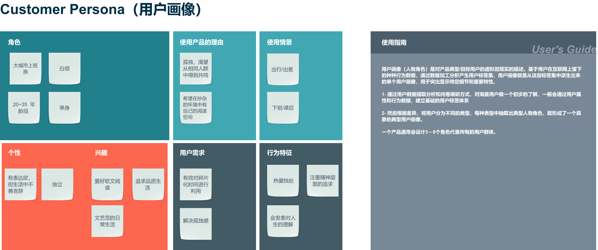
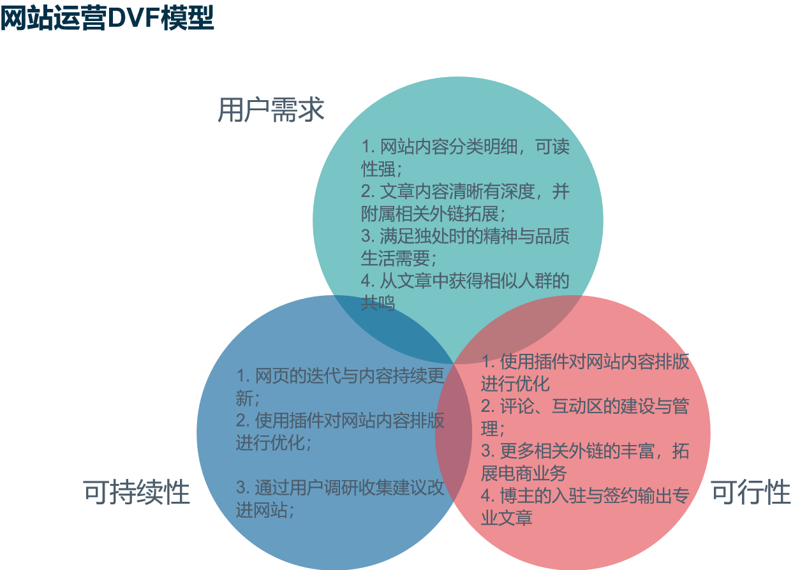

# 网站运营期末项目报告

## 网站简介
- 网站名称：Do Things Alone Now Mostly
- URL：https://doyoudo.top
- 站长：麦锋源
- 指导老师：胡美香
- 网站搭建运用wordpress模板支持

***

# 一、策划
 

## 1.策划文档与网站地图

> "策划文档"将明确对网站建设目标、目标用户、网站发展规划和网站版面设计等进行详细的介绍和说明。

 

### 网站建设目标
- 网站围绕现代城市生活中热爱独处的人为主，以博客内容的形式输出个体文化
- 通过书籍、影音、日志的形式为城市生活的人匹配属于自己的精神世界，在文字间得到心灵的共鸣
- 网站希望建立一个爱好独处或希望拥有独处的空间，远离繁杂与喧嚣

### 网站规划

|生命周期|规划|
| --- | --- |
|基础建设|网站整体架构规划、数据库后台管理、后台管理系统建设、前台界面设计、服务器运转、域名绑定|
|中期运营|网站下分四个板块进行内容更新：书籍推荐、独处指南、逃离计划、黑胶世界|
|后期拓展|四个板块将根据相关内容引入电商模式进行线上销售，包括书籍购买、旅行购票和音乐使用版权等|
|网站优化|持续更新网站内容，提供更优质的的文章，同时做好网站SEO工作提高网站流量，保持较好的网站运营能力。|

#### 项目策划表
|  | 步骤 | 措施 |
| --- | --- | --- |
| 1 | 目的及功能定位 | 通过用户访谈以及用户体验地图分析定位以及确定目标用户 |
| 2 | 技术解决方案 | (a)服务器：腾讯云定制版服务器 (b)技术栈：Centos+宝塔系统（Lnmp）+WordPress (c)网站安全性措施：利用Wordfence、site24x7监控安全性能 (d)WordPress主题：Astra (e)插件: Elementor、Elementor Pro、Jetpack、Tutor LMS、Wenprise Pinyin Slug、Wordfence Security、WPForms Lite、Yoast SEO |
| 4 | 内容规划 | 分为项目经验分享、知识分享帖子 |
| 5 | 网页设计 | 风格以轻松、求知为主要基调。并且按用户需求进行不定期改版 |
| 6 | 网站维护 | (a)内容：分享贴子一星期更新一次 (b)数据库维护：一星期备份一次以及进行分析 (c)服务器：24小时内停机不可超过5小时 |
| 7 | 网站测试 | 服务器以及数据库两天测试一次 |

 

### 目标用户画像

 

### DVF模型
基于用户调研和访谈，使用DVF模型定义需求，打造多元化的网站，更大限度地满足用户的需求。

 

#### (1)生命周期
 

#### (2)项目策划表
 

#### (3)网站地图
 

#### (4)利用DVF定义用户需求和产品目标
 

## 2.网站版面设计
 

### 2.1 图片使用
 

#### (1)图片版权
 

#### (2)图片风格及配色
 

### 2.2 字体使用
 

#### (1)字体可读性
 

### 3.平面设计
 

#### 3.1 排版及配色
 

#### 3.2 插件运用

 
 

## 二、管理
 

### 1. 云端架站
 

### 2. 网站安全
 

### 3. 网站性能
 

### 4. 网站备份

 
 

## 三、运用
 

### 1.站长工具
 

### 2.SEO优化

 
 

## 四、用户研究
 

### 1. 用户访谈
 

### 2. A/B测试

 
 

## 五、项目总结

 
 

## 六、定制化与加分项
